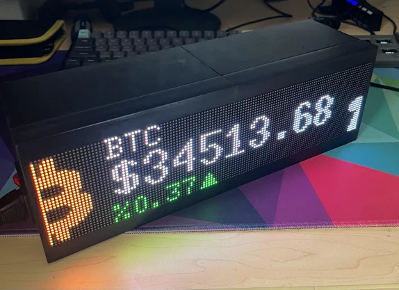

# RGB Matrix Ticker
RGB Matrix Crypto and Stock Ticker based on a Raspberry Pi
Uses a Raspberry Pi 3A+, 2 32x64 RGB matrices to form a 32x128 display, connected to the Pi with the Adafruit RGB Matrix HAT with RTC.

## NEW! MatrixTicker OS Experimental
Check out the new Experimental Release of MatrixTicker OS in the releases tab. Currently based off the Dev branch, however as stability is confirmed and stuff is fixed and tuned the custom Raspberry Pi OS image will be available for use on the Main branch!

A (nearly) complete rewrite is in progress! The new code architecture will be a lot more modular, allowing for much easier custom additions to the ticker.
Features expected to come with (or soon after) this update include:
- ~~Modules~~ Implemented!
- Web UI
- And More!

## Features planned
- Stocks
- Commodities
- Weather
- News

## Demo the Software
Install RGBMatrixEmulator:
`pip install RGBMatrixEmulator`
Comment out the rgbmatrix import and uncomment the emulator import
The emulator is available at http://localhost:8888

## Make your own
https://www.instructables.com/Cryptocurrency-and-Stock-Price-Ticker/

## Adding more symbols
I am planning on automating this process soon.
To add more functionality, do the following:

**Crypto Module:**\
1: Find the crypto you want to add on Coingecko, and locate it's API ID\
2: Add the CoinGecko ID to the configv2.yml file\
3 (Optional): Add an icon with maximum height of 32px (doesn't have to be square) into icons/crypto, with the same name as the CoinGecko ID

## Contributing
I will be welcoming and encouraging improvements and extra features to the code. If you want to add your own module or fix one of mine, make a PR!
If you want to add an icon for a crypto, make a PR!

## License
This Open Source software is distributed under the GNU GPLv3 license. It is distributed with no Warranty and I incur no Liability from your use of this software. You may modify this code however you like, and distribute it. Source code must be made available if you are distributing. You are not allowed to create closed source software based on this code. More info can be found at this website: https://choosealicense.com/licenses/gpl-3.0/

